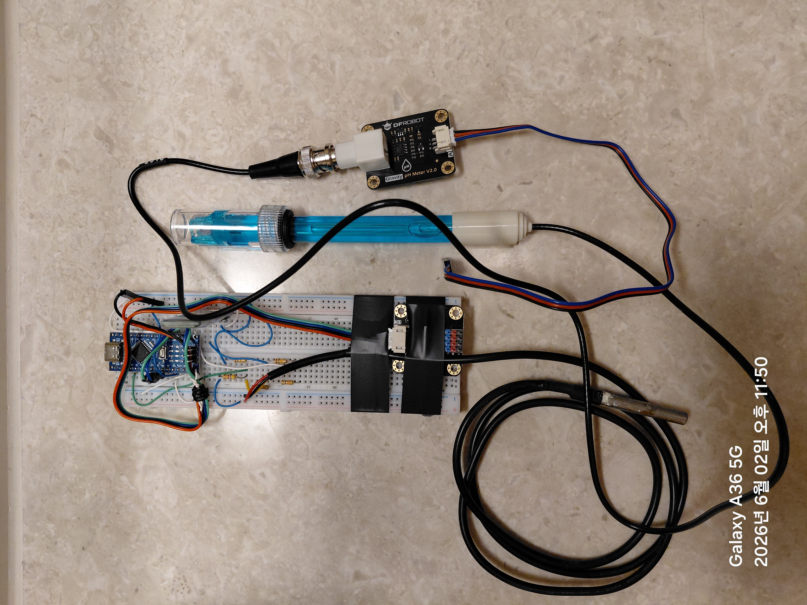

# AquaWiz - 고정밀 pH/dKH 자동 측정 시스템

🌐 **실시간 측정 그래프:** https://taeseokyi.github.io/reefwiz/
(안드로이드 Chrome에서 열어 메뉴 → **홈 화면에 추가**를 누르면 앱처럼 설치됩니다)

> **:warning: 경고:** 이 프로젝트의 하드웨어, 소프트웨어, 문서는 **어떠한 공식 검증도 거치지 않았습니다.** 측정 정확도, 전기적 안전성, 장기 신뢰성에 대한 보증이 없으며, 사용으로 발생하는 모든 결과(장비 손상, 생물 피해, 화재, 감전 등)에 대한 **책임은 전적으로 사용자 본인**에게 있습니다.

산호 수조(리프 탱크)를 위한 Arduino Nano 기반 **자동 경도(dKH) 측정기**입니다.
탄산염 화학법을 이용하여 참조 해수와 수조수의 pH 차이로부터 dKH를 자동 산출합니다.


### 최종 형태 — 밀폐 폐루프 (공통 헤드스페이스)

> **밀폐는 선택이 아니라 필수입니다.** 참조수 통·측정 챔버·펌프 흡입을 **하나의 밀폐된 공기**로 묶어, 측정 순간 참조수(ref)와 수조수(tank)가 **같은 pCO₂**를 공유하도록 보장합니다. 이것이 방 CO₂ 변동을 차동으로 상쇄하는 핵심 조건이며, 동시에 증발(경도 농축)까지 차단합니다. 밀폐 적용 후 첫 새벽(고-CO₂) 측정에서 그간 재현되던 새벽 오차가 사라졌습니다(ΔpH −0.043 → **−0.008**) — [측정 대장](docs/measurement-ledger.md) 2026-06-19 참조.

| 제어기 |
|:---:|
|  |

### 주요 특징

- **[±0.07 dKH 정확도](docs/system-setup.md#측정-정확도)** — 16비트 ADC + 64회 오버샘플링 + Nernst 온도 보정, 분해능 ±0.001 dKH
- **[PC 연동 평형 자동 측정](docs/system-setup.md#자동-측정-시퀀스-pc-측-v4)** — 샘플링 → 폭기(CO2 평형) → tank·ref **진짜 평형(평탄)까지** pH 측정 → dKH 계산 → 정리. 펌웨어가 아닌 PC측 파이썬 스크립트가 평탄(수렴) 판정으로 단계를 제어
- **[탄산염 화학법](#측정-원리)** — `KH_tank = KH_ref × 10^(-ΔpH)`, 참조수와 동시 탈기로 CO2 변수 제거
- **[Nernst 온도 보정](docs/system-setup.md#nernst-온도-보정)** — 보정 온도 EEPROM 저장, 15~35°C 전 범위 오차 0%
- **[블루투스 제어](docs/user-manual.md#14-블루투스-터미널-앱)** — HC-06으로 스마트폰에서 원격 제어/모니터링 ( <a href="https://play.google.com/store/apps/details?id=de.kai_morich.serial_bluetooth_terminal" target="_blank">Serial Bluetooth Terminal</a> 앱 추천)
- **[참조 dKH 역산](docs/user-manual.md#35-calref--참조-dkh-역산)** — 수조 dKH 실측값으로 참조수 dKH를 자동 계산, 참조수 별도 측정 불필요
- **[밀폐 공통 헤드스페이스 (필수)](docs/system-setup.md#위즈-탱크)** — 참조수·측정수·펌프 흡입이 한 밀폐 공기를 공유 → 측정 순간 ref·tank pCO₂ 일치(방 CO₂ 공통모드 상쇄) + 증발/오염 차단. 새벽 고-CO₂에서도 ΔpH 안정(2026-06-19 검증)
- **[3D 프린팅 하우징](docs/system-setup.md#하우징-3d-프린팅)** — OpenSCAD 파라메트릭 설계, 부품 실측 후 즉시 출력
- **[웹 대시보드 (PWA)](docs/user-manual.md#9-웹-대시보드)** — 측정 완료 직후 결과가 자동으로 GitHub Pages에 반영. dKH 그래프(3일/7일/전체), 평탄 수렴 곡선 조회(최근 14일), 최신값 JSON API
- **[도저 자동 조정 (권고)](docs/user-manual.md#10-도저-자동-조정-올포리프)** — 측정된 dKH 수준(3회 중앙값)·추세(7일 기울기)로 올포리프 도징량 조정을 계산. 대시보드에서 수동 도징량·목표 dKH 설정 가능
- **[reefCore 연동](docs/reefcore-integration.md)** — 측정값을 reefCore 생태계(reefChecker)에 측정 레코드로 자동 발행
- **확장 가능** — ESP32 보드와 시리얼/블루투스 연결로 Wi-Fi, 모바일 앱, 인터넷 접속으로 확장 가능

> 정밀한 pH 측정을 위해 Wi-Fi가 없는 Arduino Nano를 사용하여 전자기 간섭을 최소화하였습니다. Wi-Fi, 웹 대시보드, 데이터 로깅 등 부족한 기능은 ESP32를 시리얼/블루투스로 연결하면 해결 가능합니다.

> 연동 펌프의 토출량은 설정한 시간(초)에 비례하지만, 호스 길이나 수두차에 따라 실제 물량이 달라질 수 있습니다. 각 펌프에 PWM 속도 컨트롤러의 Motor− 출력을 L298N ENA/ENB에 연결하여 역 PWM으로 모터 속도를 제어하므로, 토출량을 미세하게 조정할 수 있습니다.

## 한눈에 보기

| 시스템 구성도 | 호스 연결도 |
|:---:|:---:|
| [](docs/system-setup.md#시스템-구성도) | [](docs/system-setup.md#호스-연결) |

| 회로도 (Fritzing) | 하우징 (3D 프린팅) |
|:---:|:---:|
| [](#회로도) | [](docs/system-setup.md#하우징-3d-프린팅) [](docs/system-setup.md#하우징-3d-프린팅) |

## 측정 정확도

> **dKH 8.5 기준, 시스템 정확도 ±0.07 dKH (±1.2%)** — pH 프로브 반복성이 전체 오차의 97%를 차지하며, 전자 회로와 펌웨어 계산 로직은 프로브 성능을 100% 활용할 수 있는 수준입니다.

| 항목 | 성능 | 핵심 기술 |
|------|------|----------|
| 측정 분해능 | **±0.001 dKH** | 16비트 ADC (ADS1115) + 64샘플 트림평균(정렬 후 상·하위 16개 버리고 중앙 32개 평균 → 폭기 버블 스파이크 제거) |
| 시스템 정확도 | **±0.07 dKH (±1.2%)** | Nernst 보정 + 동일 온도 차등 측정 |
| 온도 보정 오차 | **0%** | 보정 온도 EEPROM 저장, 15~35°C 전 범위 |

[상세 오차 분석 →](docs/system-setup.md#측정-정확도)

> **이 수치는 책상 계산이 아니라 수십 회의 실측·검증을 거쳐 다듬은 결과입니다.** 코드 버전(V0~V4)별 측정 기록, 환경 변수(방 CO₂) 통제, 차동 측정이 방 CO₂ 의존성을 제거함을 보인 ΔpH 검증, 그리고 그 해석을 뒷받침한 학술 문헌까지 — 신뢰성의 근거는 모두 [**측정 대장**](docs/measurement-ledger.md)에 시각순으로 정리되어 있습니다.

> **✅ 완전 널테스트로 확정 (2026-06-21):** 같은 물(위즈 해수)을 ref·tank 양쪽에 넣어 *물 차이를 0으로 만든* 완전 널에서 **ΔpH −0.003, dKH 8.387 (참값 8.448 대비 오차 −0.061)** 을 측정했습니다. 물 차이가 구성상 0이므로 이 −0.06 dKH가 계측기의 *순수* 시스템 offset입니다 — ±0.07 정확도 사양을 실측으로 뒷받침합니다. (참고: 측정 시점에 보였던 큰 오차는 *시험용 옛 200mL 시료 물의 알칼리니티 손실(CaCO₃ 석출)* 이었으며 계측기 오차가 아니었습니다. 신선한 물에선 무보정으로 ±0.1 dKH 안.) — [측정 대장 최종 결론](docs/measurement-ledger.md) 참조.

## 측정 원리

```
KH_tank = KH_ref × 10^(-ΔpH)
ΔpH = pH_ref − pH_tank
```

탈기 후 두 샘플의 CO2 농도가 동일해지면, pH 차이는 순수하게 알칼리니티(dKH) 차이만을 반영합니다.

> **★전제 = 같은 pCO₂.** 위 식은 측정 순간 ref·tank의 CO₂가 동일할 때만 순수 dKH차를 줍니다. 이를 보장하는 것이 **밀폐 공통 헤드스페이스**입니다 — 두 물이 하나의 밀폐 공기를 공유하므로 방 CO₂가 변해도 공통모드로 상쇄됩니다. 밀폐는 [위즈 탱크 구성](docs/system-setup.md#위즈-탱크)에서 **필수**로 다룹니다.

## 하드웨어

| 부품 | 모델 | 역할 |
|------|------|------|
| MCU | Arduino Nano V3.0 (ATmega328P) | 메인 컨트롤러 |
| pH 센서 | DFRobot SEN0161-V2 | pH 전압 측정 |
| ADC | Adafruit ADS1115 (16-bit) | I2C 고정밀 ADC |
| 온도 센서 | DS18B20 (PTFE) | Nernst 온도 보상 |
| 블루투스 | HC-06 | 하드웨어 Serial (9600 baud) |
| 모터 드라이버 | L298N x 3 | L298N1/N2: 도징 펌프 (12V), L298N3: 에어 펌프 (5V) |
| 도징 펌프 | Kamoer NKP-DC-B06S x 4 | 참조수/수조수 도징 |
| 에어 펌프 | USB 5V 에어 펌프 x 2 | 참조수/수조수 폭기 (L298N3 제어) |
| 전원 | 12V DC + Buck Converter (5V) | 전원 공급 |

- 구매 링크 포함 상세 목록: [준비물 목록](docs/parts-list.md)
- 구성 요소 상세 / 펌프 역할: [자동화 환경 구성 — 구성 요소](docs/system-setup.md#구성-요소)
- 3D 프린팅 하우징: [자동화 환경 구성 — 하우징](docs/system-setup.md#하우징-3d-프린팅)

### 회로도


Fritzing 소스: <a href="hardware/fritzing/고정밀%20ph%20측정기-bread.fzz" target="_blank">고정밀 ph 측정기-bread.fzz</a> | PDF: <a href="hardware/fritzing/고정밀%20ph%20측정기-bread_bb.pdf" target="_blank">브레드보드 도면</a>

**핀 배치 요약:**

```
D0  (RX)  ← HC-06 TX        D1  (TX)  → HC-06 RX (전압분배기)
D4~D7     → L298N1 IN1~IN4  D8~D11    → L298N2 IN1~IN4
D12       → L298N3 IN2 (에어 펌프 ON/OFF, ron/roff)  D13  → L298N3 IN4 (PWM 속도 제어기 ON/OFF, ton/toff)
A0  (D14) ← DS18B20 DQ      A4/A5     ↔ ADS1115 I2C
```

### 전원 / 접지

```
12V DC Jack
  ├── L298N1, L298N2 (모터 전원, 12V → 도징 펌프)
  ├── Buck 12V→5V (Arduino, ADS1115, HC-06)
  └── USB 5V → L298N3 (에어 펌프 제어)
속도 제어: PWM 컨트롤러 Motor− → L298N ENA/ENB (역 PWM)
접지: Star Ground Point (DGND/AGND 분리 후 한 점 결합)
```

## 빌드 및 업로드

| 라이브러리 | 제작자 |
|------------|--------|
| DFRobot_PH | DFRobot |
| Adafruit ADS1X15 | Adafruit |
| OneWire | Paul Stoffregen |
| DallasTemperature | Miles Burton |

1. Arduino IDE에서 [`firmware/aquawiz_ph_meter_final/aquawiz_ph_meter_final.ino`](firmware/aquawiz_ph_meter_final/aquawiz_ph_meter_final.ino) 열기
2. 보드: **Arduino Nano**, 프로세서: **ATmega328P** 선택
3. **HC-06을 D0/D1에서 분리** 후 업로드 → 완료 후 재연결

## 사용 방법

### 초기 설정

```
1. pH 2점 보정:   enterph → calph (pH7) → exitph → enterph → calph (pH4) → exitph
2. 온도 오프셋:   settemp:-0.3
3. 참조 dKH:      setref:8.5
```

### 자동 측정 (PC 연동)

폭기 중 측정을 반복하며 **tank·ref가 진짜 평형(평탄)에 도달할 때까지** 측정해야 하므로(평탄 판정 = 측정값 비교 후 반복 결정), 자동화는 펌웨어가 아닌 **PC측 파이썬 스크립트**가 담당합니다. 펌웨어에는 더 이상 `seq` 매크로가 없습니다.

```bash
# 1회 측정 후 종료 (Windows 작업 스케줄러 정시 호출용 / 수동 실행 가능)
python bin/measure_kh_once.py        # 포트 = 스크립트 기본값 COM9
python bin/measure_kh_once.py COM7   # 포트 직접 지정
```

스크립트는 준비(샘플링·헹굼) → **[A] tank·ref 동시 폭기 + tank 평탄까지** → 전이 → **[B] ref 평탄까지** → `calkh` → 정리 순으로 펌웨어 명령을 단계별 전송합니다. 상세 흐름·상수·스케줄러 등록은 [자동화 환경 구성 — 자동 측정 시퀀스](docs/system-setup.md#자동-측정-시퀀스-pc-측-v4)를 참조하세요.

### 주요 명령어

| 분류 | 명령어 |
|------|--------|
| pH 측정 | `ref`, `tank`, `calkh`, `calref`, `status`, `khhist` |
| pH 보정 | `enterph`, `calph`, `exitph` |
| 설정 | `settime:HH`, `setref:x`, `settemp:x` |
| 모터 | `m1f:초`, `m1b:초`, `m1s` (m1~m4) |
| 에어/PWM | `ron`/`roff` (D12 에어 ON/OFF), `ton`/`toff` (D13 PWM 제어기 ON/OFF), `airoff` (둘 다 OFF) |
| 정지 | `m1s`~`m4s` (개별), `stop` (전체 모터+핀 OFF) |

전체 명령어 및 상세 설명은 [사용 설명서](docs/user-manual.md)를 참조하세요.

## 문서

| 문서 | 설명 |
|------|------|
| [자동화 환경 구성](docs/system-setup.md) | 구성 요소, 호스 연결, 측정 시퀀스, 동기화 파이프라인, 하우징 |
| [사용 설명서](docs/user-manual.md) | 전체 명령어, 보정, 오류 메시지, 웹 대시보드, 도저 자동 조정 |
| [준비물 목록](docs/parts-list.md) | 부품 사진, 구매 링크, 금액 |
| [**측정 대장**](docs/measurement-ledger.md) | 코드 버전별 실측 기록·환경·ΔpH 검증·참조 문헌 — **결과 신뢰성의 근거** |
| [reefCore 연동](docs/reefcore-integration.md) | 측정값을 reefCore 생태계에 발행하는 MQTT 연동 |
| [블루투스 재연결](docs/bt-reconnect-and-testing.md) | HC-06 RF 순단 대응·장기 사망 보강·시뮬레이터 회귀 검증 |

## 산호 수조 권장 dKH 범위

| 유형 | dKH |
|------|-----|
| 자연 해수 | 6.5 ~ 7.5 |
| 산호 수조 권장 | 8 ~ 12 |
| SPS 경산호 최적 | 8 ~ 9 |
| LPS/소프트 코랄 | 7 ~ 11 |

## 라이선스

이 프로젝트는 개인 용도로 제작되었습니다.

---

이 프로젝트의 펌웨어, 문서, 다이어그램, 하우징 설계의 **80% 이상이 AI의 도움**을 받아 작성되었습니다.
