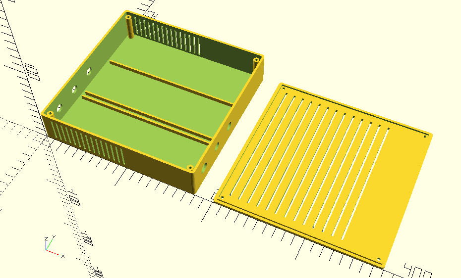
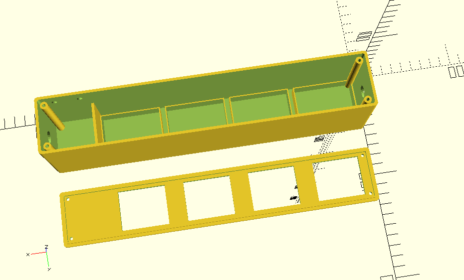
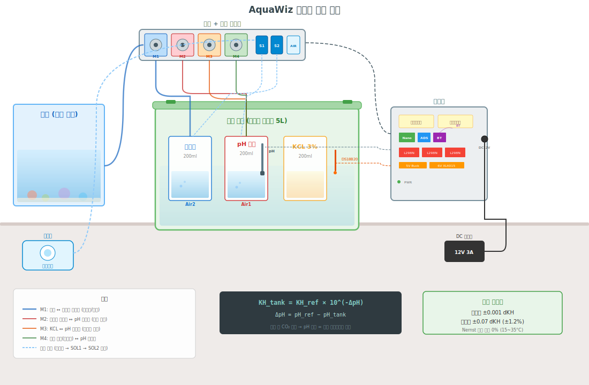
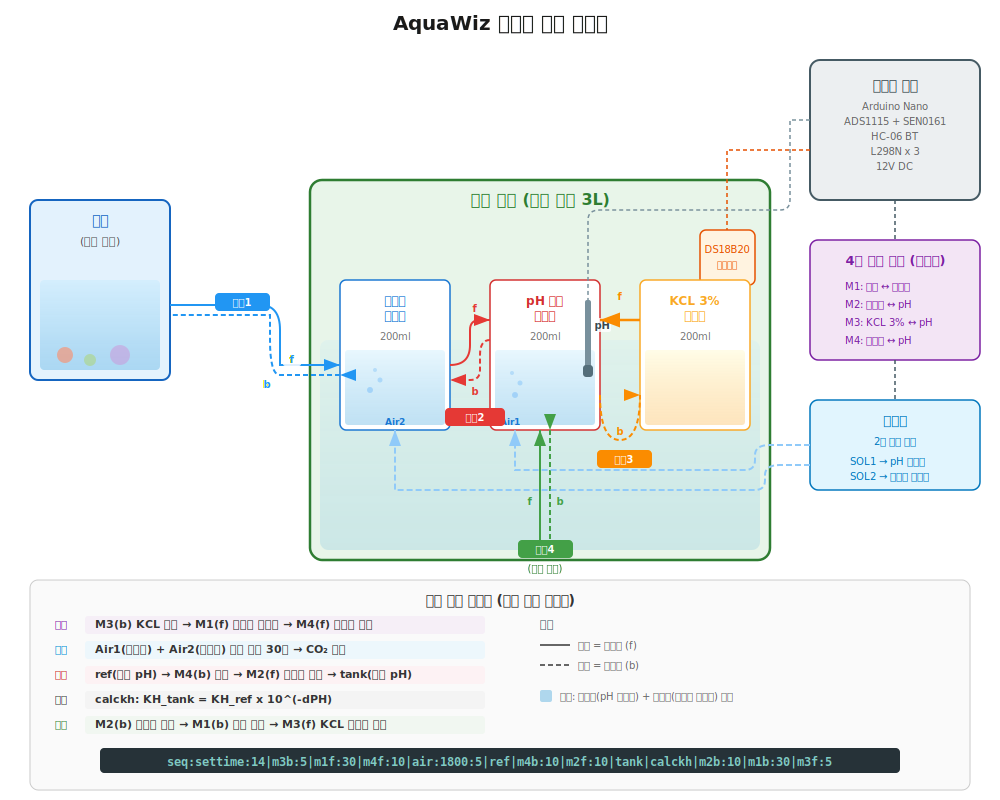

# AquaWiz - 고정밀 pH/dKH 자동 측정 시스템

산호 수조(리프 탱크)를 위한 Arduino Nano 기반 자동 경도(dKH) 측정기입니다. 탄산염 화학법을 이용하여 참조 해수와 수조수의 pH 차이로부터 dKH를 산출합니다.

## 측정 원리

탈기 후 두 샘플의 CO2 농도가 동일해지면, pH 차이는 순수하게 알칼리니티(dKH) 차이만을 반영합니다.

```
KH_tank = KH_ref x 10^(-DeltaPH)
DeltaPH = pH_ref - pH_tank
```

## 하드웨어 구성

| 부품 | 모델 | 역할 |
|------|------|------|
| MCU | Arduino Nano V3.0 (ATmega328P) | 메인 컨트롤러 |
| pH 센서 | DFRobot SEN0161-V2 | pH 전압 측정 |
| ADC | Adafruit ADS1115 (16-bit) | I2C 고정밀 ADC |
| 온도 센서 | DS18B20 (PTFE) | Nernst 온도 보상 |
| 블루투스 | HC-06 | 하드웨어 Serial (9600 baud) |
| 모터 드라이버 | L298N x 3 | 펌프 4개 + 솔레노이드 2개 |
| 도징 펌프 | Kamoer NKP-DC-B06S x 4 | 참조수/수조수 도징 |
| 솔레노이드 밸브 | x 2 | 참조/수조 에어 교대 공급 |
| 전원 | 12V DC + Buck Converter (5V, 6V) | 전원 공급 |

구매 링크 포함 상세 준비물 목록은 [준비물 목록](docs/parts-list.md)을 참조하세요.

### 하우징 (3D 프린팅)

| 하우징 | 외부 치수 | 미리보기 |
|--------|----------|---------|
| [제어기](hardware/housing/controller-box.scad) | 180 x 173 x 45mm |  |
| [펌프+분배기](hardware/housing/pump-air-box.scad) | 296 x 53 x 75mm |  |

OpenSCAD 파라메트릭 설계 — 부품 실측 후 상단 파라미터만 수정하면 치수 자동 조정됩니다.

### 회로도


Fritzing 소스: <a href="hardware/fritzing/고정밀%20ph%20측정기-bread.fzz" target="_blank">고정밀 ph 측정기-bread.fzz</a> | PDF: <a href="hardware/fritzing/고정밀%20ph%20측정기-bread_bb.pdf" target="_blank">브레드보드 도면</a>

**핀 배치 요약:**

```
Arduino Nano 핀 할당 (총 15핀 사용)

D0  (RX)  ← HC-06 TX (블루투스 수신)
D1  (TX)  → HC-06 RX (전압분배기 R4=10k, R5=20k)
D4~D7     → L298N1 IN1~IN4 (펌프 모터 1,2)
D8~D11    → L298N2 IN1~IN4 (펌프 모터 3,4)
D12       → L298N3 IN2 (참조 에어 솔레노이드)
D13       → L298N3 IN4 (수조 에어 솔레노이드)
A0  (D14) ← DS18B20 DQ (풀업 R2=4.7k)
A4        ↔ ADS1115 SDA (I2C)
A5        ↔ ADS1115 SCL (I2C)
```

### 전원 계통

```
12V DC Jack
  ├── L298N1, L298N2, L298N3 (모터/솔레노이드 전원)
  ├── Buck Converter 12V→5V (Arduino, ADS1115, HC-06)
  └── Buck Converter 12V→6V (도징 펌프)
```

### 접지 설계

Star Ground Point 방식을 사용하여 디지털 접지(DGND)와 아날로그 접지(AGND)를 분리하고, 한 점에서 결합합니다.

## 자동화 환경 구성

### 셋팅 구성



### 시스템 구성도



자세한 호스 연결, 시퀀스 흐름은 [자동화 환경 구성 문서](docs/system-setup.md)를 참조하세요.

## 프로젝트 구조

```
reefkeeper/
├── README.md
├── firmware/
│   └── aquawiz_ph_meter_final/
│       └── aquawiz_ph_meter_final.ino   # Arduino 펌웨어
├── hardware/
│   ├── fritzing/
│   │   ├── 고정밀 ph 측정기-bread.fzz   # Fritzing 소스
│   │   └── 고정밀 ph 측정기-bread_bb.pdf # 브레드보드 도면 PDF
│   ├── parts/                           # 커스텀 Fritzing 부품
│   │   └── ...
│   └── housing/                         # 3D 프린팅 하우징
│       ├── controller-box.scad          # 제어기 하우징 (OpenSCAD)
│       ├── controller-box.png           # 미리보기
│       ├── pump-air-box.scad            # 펌프+분배기 하우징
│       └── pump-air-box.png             # 미리보기
└── docs/
    ├── user-manual.md                   # 사용 설명서
    ├── system-setup.md                  # 자동화 환경 구성
    ├── parts-list.md                    # 준비물 목록 (구매 링크)
    └── images/
        ├── system-setup.svg             # 시스템 구성도
        ├── piping-diagram.svg           # 호스 연결도
        └── arduino-nano-pinout.png      # 나노 핀 배열 참조
```

## 빌드 및 업로드

### 필수 라이브러리 (Arduino Library Manager)

| 라이브러리 | 제작자 |
|------------|--------|
| DFRobot_PH | DFRobot |
| Adafruit ADS1X15 | Adafruit |
| OneWire | Paul Stoffregen |
| DallasTemperature | Miles Burton |

### 업로드 절차

1. Arduino IDE에서 `firmware/aquawiz_ph_meter_final/aquawiz_ph_meter_final.ino` 열기
2. 보드: **Arduino Nano**, 프로세서: **ATmega328P** 선택
3. **HC-06을 D0/D1에서 분리** (분리하지 않으면 업로드 실패)
4. 업로드 완료 후 HC-06 재연결

## 사용 방법

### 초기 설정

```
1. pH 2점 보정:   enterph → calph (pH7) → exitph → enterph → calph (pH4) → exitph
2. 온도 오프셋:   settemp:-0.3    (DS18B20과 표준 온도계 차이)
3. 참조 dKH:      setref:8.5      (참조 해수의 실측 dKH)
```

### 측정

```
1. settime:14        (현재 시 설정)
2. ref               (참조수 pH 측정, ~8초)
3. tank              (수조수 pH 측정, ~8초)
4. calckh            (dKH 계산 + 이력 저장)
```

### 자동 시퀀스

준비(샘플링) → 폭기(CO2 평형) → 측정 → 정리(반환)를 한 번에 실행:

```
seq:settime:14|m3b:5|m1f:30|m4f:10|air:1800:5|ref|m4b:10|m2f:10|tank|calckh|m2b:10|m1b:30|m3f:5
```

폭기 전에 참조수(pH 비이커)와 수조수(수조물 비이커)를 모두 준비한 뒤 동시 탈기합니다.

### 주요 명령어

| 분류 | 명령어 |
|------|--------|
| pH 측정 | `ref`, `tank`, `calckh`, `status`, `khhist` |
| pH 보정 | `enterph`, `calph`, `exitph` |
| 설정 | `settime:HH`, `setref:x`, `settemp:x` |
| 모터 | `m1f:초`, `m1b:초`, `m1s` (m1~m4) |
| 에어 | `air:총초:주기초`, `airoff` |
| 시퀀스 | `seq:cmd1\|cmd2\|...`, `seqstop` |

전체 명령어 및 상세 설명은 [사용 설명서](docs/user-manual.md)를 참조하세요.

## 산호 수조 권장 dKH 범위

| 유형 | dKH |
|------|-----|
| 자연 해수 | 6.5 ~ 7.5 |
| 산호 수조 권장 | 8 ~ 12 |
| SPS 경산호 최적 | 8 ~ 9 |
| LPS/소프트 코랄 | 7 ~ 11 |

## 라이선스

이 프로젝트는 개인 용도로 제작되었습니다.
