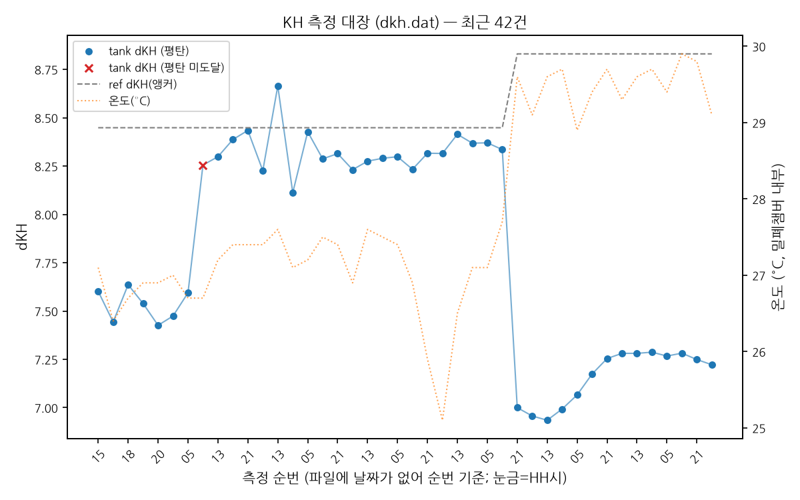

# AquaWiz

산호 수조용 고정밀 pH/dKH 자동 측정기 문서 모음입니다. 전체 개요는 [프로젝트 README](https://github.com/taeseokyi/reefwiz#readme)를 먼저 보세요.

## dKH 측정 대장 — 실시간 그래프

하루 3회(05/13/21시) 측정 결과가 자동으로 반영됩니다. 상세 기록·검증 근거는 [측정 대장](measurement-ledger.md)에 있습니다.

## 문서

- [측정 대장](measurement-ledger.md) — 코드 버전별 실측 기록·환경·ΔpH 검증·참조 문헌
- [사용 설명서](user-manual.md)
- [자동화 환경 구성](system-setup.md)
- [준비물 목록](parts-list.md)
- [reefCore 연동](reefcore-integration.md)
- [블루투스 재연결/테스트](bt-reconnect-and-testing.md)
- [연구 노트 모음](notes/README.md)
