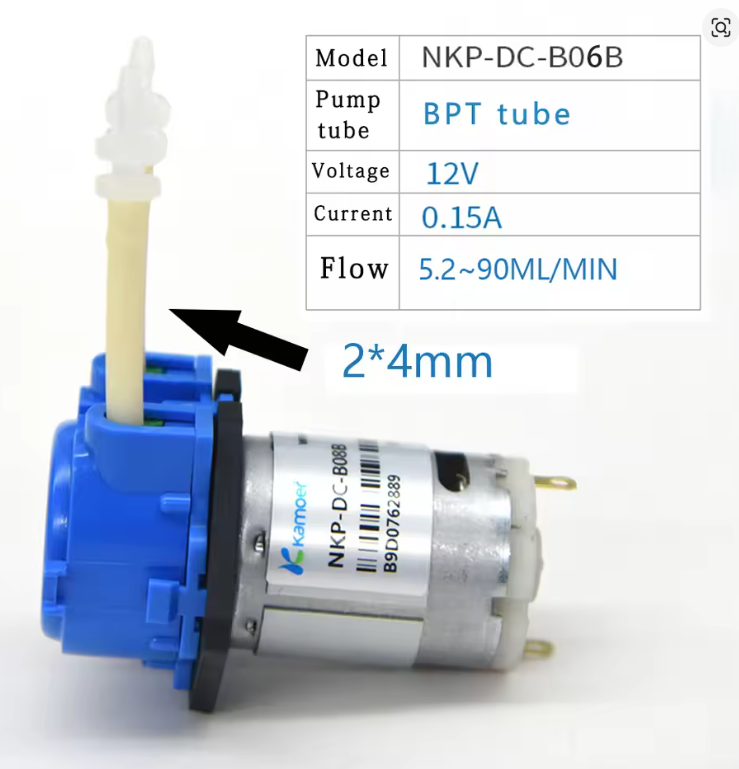

# AquaWiz 준비물 목록

> 관련 문서: [프로젝트 개요 (README)](../README.md) | [자동화 환경 구성](system-setup.md) | [사용 설명서](user-manual.md)

## 디바이스마트 (주문번호: 2026052420462117683)

| # | 사진 | 부품명 | 수량 | 금액 |
|---|------|--------|------|------|
| 1 |  | <a href="https://www.devicemart.co.kr/goods/view?no=15315999" target="_blank">아두이노 나노 호환보드 V3.0 CH340 C타입</a> | 1 | 5,500원 |
| 2 |  | <a href="https://www.devicemart.co.kr/goods/view?no=14592629" target="_blank">Gravity: I2C ADS1115 16-Bit ADC Module</a> | 1 | 23,000원 |
| 3 |  | <a href="https://www.devicemart.co.kr/goods/view?no=14593211" target="_blank">Gravity: Analog pH Sensor/Meter Kit V2</a> | 1 | 57,500원 |
| 4 |  | <a href="https://www.devicemart.co.kr/goods/view?no=1278835" target="_blank">2A L298 모터드라이버 모듈 (아두이노 호환)</a> | 3 | 8,100원 |
| 5 |  | <a href="https://www.devicemart.co.kr/goods/view?no=1376882" target="_blank">블루투스 모듈 HC-06 (DIP) 펌웨어 v1.8</a> | 1 | 5,500원 |
| 6 |  | <a href="https://www.devicemart.co.kr/goods/view?no=1321161" target="_blank">5V 고정 출력 강하형 DC-DC 3A 컨버터</a> | 1 | 3,500원 |
| 7 |  | <a href="https://www.devicemart.co.kr/goods/view?no=1321262" target="_blank">FND 전압표시 XL4015 강하형 DC-DC 5A 가변 컨버터</a> | 1 | 4,300원 |
| 8 |  | <a href="https://www.devicemart.co.kr/goods/view?no=1345967" target="_blank">PWM 12V 2A DC모터 속도 제어 컨트롤러</a> | 4 | 8,000원 |
| 9 |  | <a href="https://www.devicemart.co.kr/goods/view?no=1322408" target="_blank">브레드보드 830핀 MB-102</a> | 2 | 2,800원 |
| | | **디바이스마트 소계** | | **130,020원** |

> 결제일: 2026-05-24 / 결제방식: 카드

## AliExpress (주문번호: 1120797983932991)

| # | 사진 | 부품명 | 수량 | 금액 |
|---|------|--------|------|------|
| 10 |  | <a href="https://www.aliexpress.com/item/1005001888639071.html" target="_blank">연동 펌프 NKP-DC-B06B (12V, yellow)</a> | 4 | ₩21,680 |
| | | **AliExpress 소계** | | **₩21,680** |

> 주문일: 2026-05-24 / 결제수단: KakaoPay

## 별도 구매 필요 부품

### 전자부품

| # | 부품명 | 사양 | 수량 | 용도 |
|---|--------|------|------|------|
| 11 | DS18B20 방수 온도센서 | PTFE 케이블, 1-Wire | 1 | Nernst 온도 보상 (위즈 탱크 침수) |
| 12 | 3-way 솔레노이드 밸브 | DC 12V, 상시닫힘 | 2 | 에어 교대 공급 (SOL1, SOL2 직렬) |
| 13 | 세라믹 콘덴서 100nF (104) | 50V 이상 | 3~5 | 전원 노이즈 제거 (ADS1115, DS18B20, L298N 등) |
| 14 | 저항 4.7kΩ | 1/4W | 1 | DS18B20 풀업 저항 (A0 → VCC) |
| 15 | 저항 10kΩ | 1/4W | 1 | HC-06 TX 전압분배기 (R4) |
| 16 | 저항 20kΩ | 1/4W | 1 | HC-06 TX 전압분배기 (R5) |
| 17 | 12V DC 어댑터 | 12V 3A 이상 | 1 | 전체 시스템 전원 |
| 18 | DC 잭 (배럴커넥터) | 5.5x2.1mm | 1 | 어댑터 연결용 |
| 19 | 점퍼 와이어 | M-M, M-F 혼합 | 1세트 | 브레드보드 배선 |

### 비전자 부품 (실험 환경)

| # | 부품명 | 사양 | 수량 | 용도 |
|---|--------|------|------|------|
| 20 | 기포기 (에어펌프) | 수족관용 | 1 | 폭기용 에어 공급원 |
| 21 | 실리콘 호스 | 내경 2~4mm | 적량 | 펌프/에어 연결 |
| 22 | 비이커 | 200ml | 3 | 수조물 / pH 측정 / KCL 3% |
| 23 | 위즈 탱크 용기 | 다이소 락앤락 김치통 (3L 이상) | 1 | 참조 해수 + 비이커 수납 (아래 참고) |
| 24 | KCL 3% 용액 | - | 적량 | pH 프로브 저장수 (건조 방지) |
| 25 | pH 보정 버퍼 용액 | pH 4.0 / pH 7.0 | 각 1 | pH 2점 보정 |

## 총 합계

| 구매처 | 금액 |
|--------|------|
| 디바이스마트 | 130,020원 |
| AliExpress | 21,680원 |
| 별도 구매 | 미정 |
| **주문 합계** | **151,700원** |
