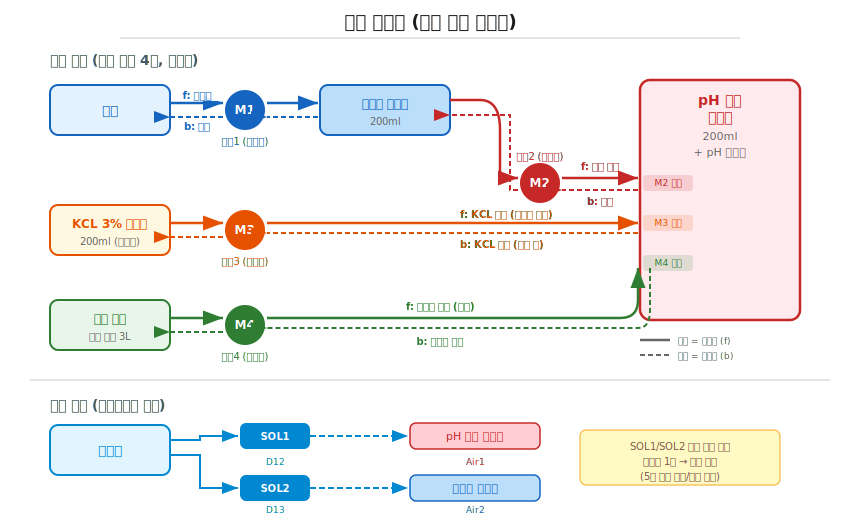

# AquaWiz 자동화 환경 구성

> 관련 문서: [프로젝트 개요 (README)](../README.md) | [사용 설명서](user-manual.md) | [준비물 목록](parts-list.md)

## 시스템 구성도


## 호스 연결



## 준비물

구매 링크 포함 상세 목록은 [준비물 목록](parts-list.md)을 참조하세요.

## 하우징 (3D 프린팅)

| 제어기 하우징 | 펌프 + 에어 분배기 하우징 |
|:---:|:---:|
|  |  |
| 180 x 173 x 45mm | 296 x 53 x 75mm |
| <a href="../hardware/housing/controller-box.scad" target="_blank">OpenSCAD 도면</a> | <a href="../hardware/housing/pump-air-box.scad" target="_blank">OpenSCAD 도면</a> |

OpenSCAD 파라메트릭 설계 — 부품 실측 후 상단 파라미터만 수정하면 치수 자동 조정됩니다.

## 구성 요소

### 제어기 본체

| 구성 | 사양 |
|------|------|
| MCU | Arduino Nano V3.0 (ATmega328P) |
| pH 센서 | DFRobot SEN0161-V2 + ADS1115 16bit ADC |
| 온도 센서 | DS18B20 (위즈 탱크 내 침수) |
| 통신 | HC-06 블루투스 (9600 baud) |
| 모터 드라이버 | L298N1/L298N2 (펌프, 12V) + L298N3 (솔레노이드, 6V) |
| 전원 | 12V DC → Buck 5V (MCU) + Buck 6V (펌프/솔레노이드) |

### 연동 펌프 (4구, 모두 양방향)

| 펌프 | 경로 | 정방향 (f) | 역방향 (b) |
|------|------|------------|------------|
| 펌프1 (M1) | 수조 ↔ 수조물 비이커 | 수조 → 수조물 비이커 (샘플링) | 수조물 비이커 → 수조 (반환) |
| 펌프2 (M2) | 수조물 비이커 ↔ pH 측정 비이커 | 수조물 → pH 비이커 (측정 이송) | pH 비이커 → 수조물 (측정 후 반환) |
| 펌프3 (M3) | KCL 3% 비이커 ↔ pH 측정 비이커 | KCL → pH 비이커 (프로브 보관) | pH 비이커 → KCL 비이커 (저장수 배출) |
| 펌프4 (M4) | 위즈 탱크 ↔ pH 측정 비이커 | 참조수 → pH 비이커 (측정 이송) | pH 비이커 → 위즈 탱크 (참조수 반환) |

### 에어 공급 (3-way 솔레노이드 직렬 연결)

| 채널 | 위치 | 용도 |
|------|------|------|
| Air1 (솔레노이드1, D12) | pH 측정 비이커 | 참조수 탈기 (폭기 시 참조수가 담겨 있음) |
| Air2 (솔레노이드2, D13) | 수조물 비이커 | 수조수 탈기 (폭기 시 수조수가 담겨 있음) |

- 기포기 → SOL1 → SOL2 직렬 연결
- SOL1 ON → pH 측정 비이커 (참조수 폭기), SOL1 OFF → SOL2로 전달
- SOL2 ON → 수조물 비이커 (수조수 폭기)
- 5초 주기로 SOL1/SOL2 교대 작동하여 에어 분배

### 위즈 탱크

| 항목 | 사양 |
|------|------|
| 용기 | 다이소 락앤락 김치통 (3L 이상) |
| 내용물 | 참조 해수 (알려진 dKH 값) |
| 센서 | DS18B20 온도 센서 침수 |
| 비이커 | 200ml x 3개 (수조물, pH 측정, KCL 3%) |

모든 비이커는 위즈 탱크 안에 담겨 있어 참조수와 동일한 온도 환경을 유지합니다.

> **락앤락 김치통을 사용하는 이유:** 참조 해수의 dKH 값이 측정 기준이 되므로, 증발에 의한 농도 변화나 외부 오염에 의한 경도 변동을 최소화해야 합니다. 밀폐력이 우수한 락앤락 김치통은 참조수의 증발과 오염을 차단하여 경도를 장기간 일정하게 유지하는 데 적합합니다.

## 자동 측정 시퀀스

### 전체 흐름

폭기(CO2 평형) 시 참조수와 수조수가 **동시에** 탈기되어야 하므로,
폭기 전에 두 샘플이 모두 준비되어 있어야 합니다.

- **pH 측정 비이커**: 참조수 (펌프4로 이송)
- **수조물 비이커**: 수조수 (펌프1로 이송)

```
── 준비 ──────────────────────────────────────────

① KCL 저장수 배출
   펌프3 역방향: pH 비이커 → KCL 비이커 (m3b:초)
   → pH 비이커를 비워서 참조수를 받을 준비

② 수조수 샘플링
   펌프1 정방향: 수조 → 수조물 비이커 (m1f:30)

③ 참조수 이송
   펌프4 정방향: 위즈 탱크 → pH 측정 비이커 (m4f:초)

── 폭기 (CO₂ 평형) ──────────────────────────────

④ 동시 탈기 (30분, 5초 주기 교대)
   Air1 ↔ Air2 교대 공급 (air:1800:5)
   Air1 → pH 측정 비이커 (참조수)
   Air2 → 수조물 비이커 (수조수)
   → 두 샘플의 CO₂ 농도를 동일하게 평형

── 측정 ──────────────────────────────────────────

⑤ 참조수 pH 측정
   ref: pH 비이커의 참조수 pH 측정 (64회 오버샘플링, ~8초)

⑥ 참조수 반환
   펌프4 역방향: pH 비이커 → 위즈 탱크 (m4b:초)

⑦ 수조수 이송
   펌프2 정방향: 수조물 비이커 → pH 측정 비이커 (m2f:초)

⑧ 수조수 pH 측정
   tank: pH 비이커의 수조수 pH 측정 (64회 오버샘플링, ~8초)

⑨ dKH 계산
   calckh: KH_tank = KH_ref x 10^(-DeltaPH)

── 정리 ──────────────────────────────────────────

⑩ 수조수 반환
   펌프2 역방향: pH 비이커 → 수조물 비이커 (m2b:초)

⑪ 수조수 원복
   펌프1 역방향: 수조물 비이커 → 수조 (m1b:초)

⑫ 프로브 보관
   펌프3 정방향: KCL 3% → pH 측정 비이커 (m3f:초)
   → 프로브가 건조해지지 않도록 KCL 용액에 침수 보관
```

### 시퀀스 명령 예시

```
seq:settime:14|m3b:5|m1f:30|m4f:10|air:1800:5|ref|m4b:10|m2f:10|tank|calckh|m2b:10|m1b:30|m3f:5
```

| 단계 | 명령 | 구간 | 동작 |
|------|------|------|------|
| 1 | `settime:14` | 준비 | 시각 설정 (이력용) |
| 2 | `m3b:5` | 준비 | 펌프3(b): KCL 저장수 배출 |
| 3 | `m1f:30` | 준비 | 펌프1(f): 수조 → 수조물 비이커 (샘플링) |
| 4 | `m4f:10` | 준비 | 펌프4(f): 위즈 탱크 → pH 비이커 (참조수 이송) |
| 5 | `air:1800:5` | 폭기 | 동시 탈기 30분 (참조수+수조수 CO₂ 평형) |
| 6 | `ref` | 측정 | 참조수 pH 측정 |
| 7 | `m4b:10` | 측정 | 펌프4(b): 참조수 → 위즈 탱크 반환 |
| 8 | `m2f:10` | 측정 | 펌프2(f): 수조물 비이커 → pH 비이커 |
| 9 | `tank` | 측정 | 수조수 pH 측정 |
| 10 | `calckh` | 측정 | dKH 계산 + 이력 저장 |
| 11 | `m2b:10` | 정리 | 펌프2(b): 수조수 → 수조물 비이커 반환 |
| 12 | `m1b:30` | 정리 | 펌프1(b): 수조물 비이커 → 수조 반환 |
| 13 | `m3f:5` | 정리 | 펌프3(f): KCL 3% 저장수 공급 (프로브 보관) |

> **팁:** seq 명령은 시리얼 버퍼 크기(128바이트)의 제한이 있습니다. 명령이 길어지면 작업 절차를 나누어 순차적으로 실행할 수 있습니다. 예시:
> ```
> seq:settime:14|m3b:5|m1f:30|m4f:10|air:1800:5|ref|m4b:10
> seq:m2f:10|tank|calckh|m2b:10|m1b:30|m3f:5
> ```

## 온도 환경

위즈 탱크(3L) 안에 모든 비이커(200ml)가 담겨 있으므로:

- 참조수, 수조수 샘플, KCL 3%이 모두 동일 온도로 유지됨
- DS18B20이 위즈 탱크 수온을 측정하여 Nernst 온도 보상에 사용
- pH 전극의 온도 보상이 정확해짐
